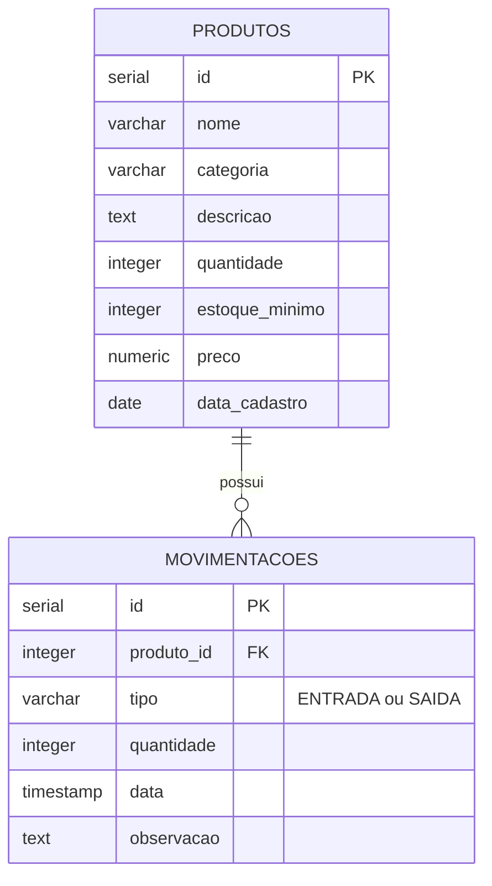

# Modelo de Dados (DER) – SmartStock

```mermaid
erDiagram
    PRODUTOS ||--o{ MOVIMENTACOES : "possui"
    PRODUTOS {
        serial id PK
        varchar nome
        varchar categoria
        text descricao
        integer quantidade
        integer estoque_minimo
        numeric preco
        date data_cadastro
    }
    MOVIMENTACOES {
        serial id PK
        integer produto_id FK
        varchar tipo "ENTRADA ou SAIDA"
        integer quantidade
        timestamp data
        text observacao
    }
```

Cada produto pode ter várias movimentações. Excluir um produto remove suas movimentações (`ON DELETE CASCADE`).
